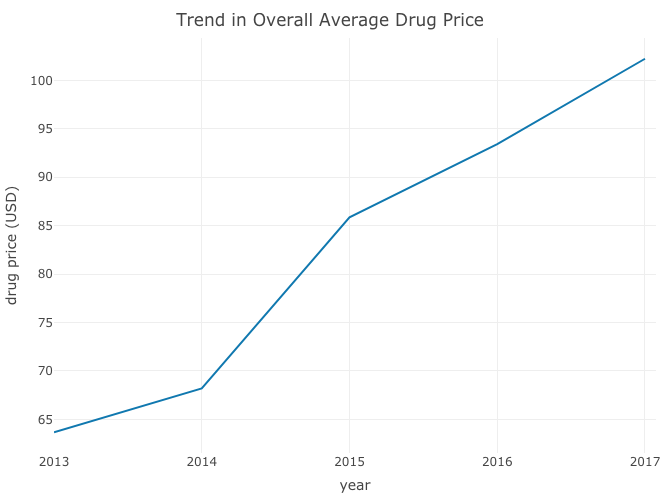

---
output:
  html_document: 
    code_folding: null 
---
#

**High drug prices have become an increasing concern in the United States.**
In 2016, **1 in 5** Americans reported taking four or more prescription drugs. This project aims to explore factors associated with US prescription drug prices. Those factors include disease research funding, drug need (prevalence), sales, and advertising.

Based on our exploratory analyses, the overall average drug price has increased from 2013 to 2017. We explored NIH funding,  drug need (prevalence), sales, and advertising and found that none of these factors influenced average drug price.  

##### Watch this video for a tour of our website:  

 <iframe width="560" height="315" src="https://www.youtube.com/embed/_dYqz8tAmIg" frameborder="0" gesture="media" allow="encrypted-media" allowfullscreen></iframe>